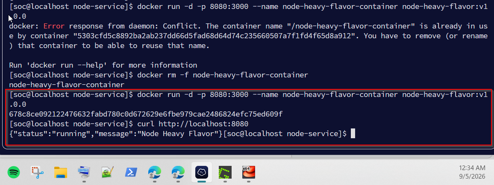
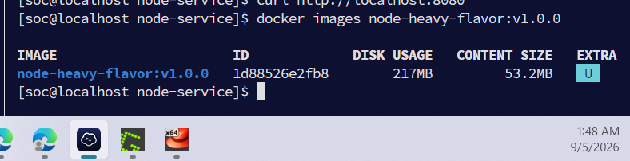
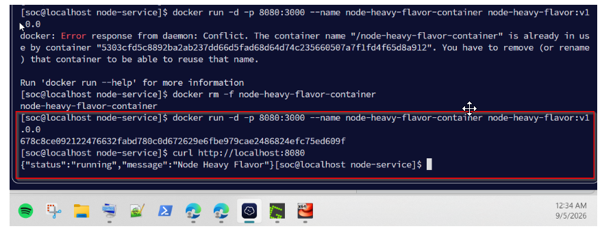

#Build Evidence: Node.js Service (Ticket 1.0)

Status:  BUILD successful  
Date: September 5, 2026  
Environment: Ubuntu 22.04 (Local Development)

# Timestamped Screenshots

1. Docker Build Process

2. Docker Image Size Check

3. Application Running & Verified via curl

------------

#Technical Notes
- I used node `node:20-alpine` as the base image This dropped the final footprint down to **53.2 MB**,
 which keeps deployments and startup times fast.
-  I ran a local check using `curl localhost:8080:3000`. The container responded successfully with:
 `{"status":"running","message":"Node Heavy Flavor"}`.

